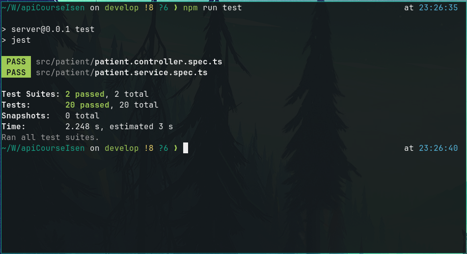

# Projet API ISEN

-   Lancer le projet

```sh
npm install
# avec hotreload
npm run start:dev
```

-   Lancer les tests



```sh
npm run test
```

-   Swagger : [`http://localhost:3000/api`](http://localhost:3000/api)

---

Se connecter avec le script utiliser le token avec postman

-   Toutes les routes sont sécurisées (il y a des décorateurs `@Public` etc...)

-   Possible de choisir de ne sécuriser que certaines routes également avec le décorateur `@UseGuard(MonGuard)` sur la route ou sur le controller complet

-   Désactiver l'auth : commenter/supprimer cette partie dans `app.module.ts`

```ts
    providers: [
        {
            provide: APP_GUARD,
            useClass: AuthGuard,
        },
    ],
```
